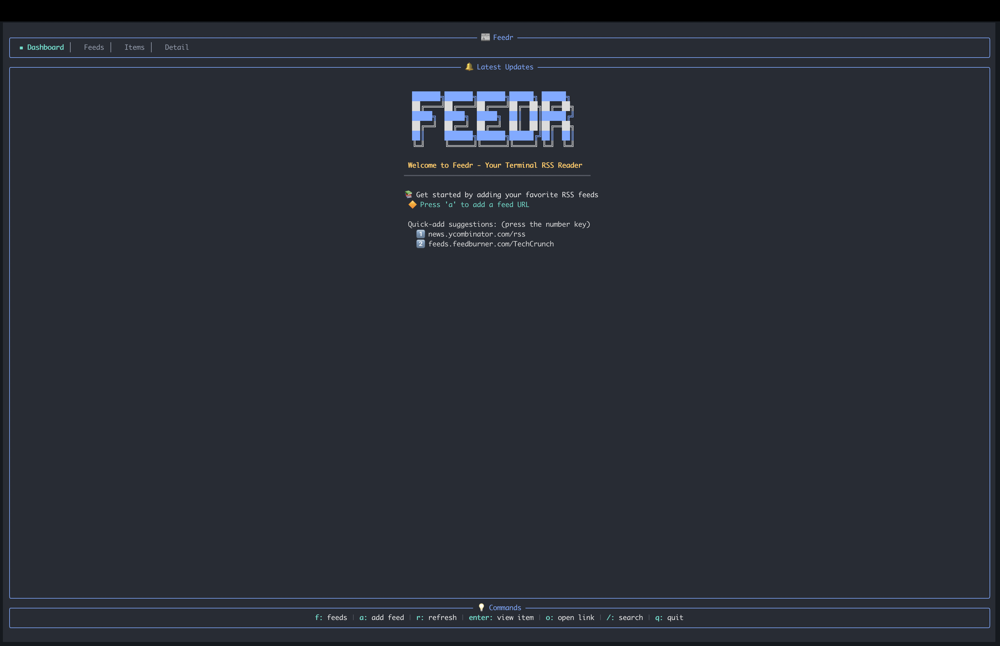

# Feedr - Terminal RSS Feed Reader 📰

Feedr is a feature-rich terminal-based RSS feed reader written in Rust. It provides a clean, intuitive TUI interface for managing and reading RSS feeds with elegant visuals and smooth keyboard navigation.



## Features

- **Dashboard View**: See the latest articles across all your feeds
- **Feed Management**: Subscribe to and organize multiple RSS feeds
- **Rich Content Display**: Beautiful formatting of articles with HTML-to-text conversion
- **Smart Search**: Quickly find content across all your feeds
- **Browser Integration**: Open articles in your default browser
- **Background Refresh**: Automatic feed updates with configurable intervals and smart rate limiting
- **Rate Limiting**: Prevents "too many requests" errors with per-domain request throttling (ideal for Reddit feeds)
- **Configurable**: Customize timeouts, UI behavior, and default feeds via TOML config file
- **XDG Compliant**: Follows standard directory specifications for configuration and data storage

## Installation

### Prerequisites

- Rust and Cargo (install from [https://rustup.rs/](https://rustup.rs/))

### Using Cargo Install (Recommended)
```bash
cargo install feedr
```

### Build from Source
```bash
git clone https://github.com/bahdotsh/feedr.git
cd feedr
cargo build --release
```

The binary will be available at `target/release/feedr`.

## Usage

Run the application:

```bash
feedr
```

### Quick Start
1. When you open Feedr for the first time, press `a` to add a feed
2. Enter a valid RSS feed URL (e.g., `https://news.ycombinator.com/rss`)
3. Use arrow keys to navigate and `Enter` to view items
4. Press `o` to open the current article in your browser

### Keyboard Controls

#### General Navigation
| Key | Action |
|-----|--------|
| `Tab` | Cycle between views |
| `q` | Quit application |
| `r` | Refresh all feeds |
| `/` | Search mode |

#### Dashboard View
| Key | Action |
|-----|--------|
| `f` | Go to feeds list |
| `a` | Add a new feed |
| `↑/↓` | Navigate items |
| `Enter` | View selected item |
| `o` | Open link in browser |

#### Feed List View
| Key | Action |
|-----|--------|
| `h` / `Esc` | Go to dashboard |
| `a` | Add a new feed |
| `d` | Delete selected feed |
| `↑/↓` | Navigate feeds |
| `Enter` | View feed items |

#### Feed Items View
| Key | Action |
|-----|--------|
| `h` / `Esc` | Back to feeds list |
| `Home` | Go to dashboard |
| `↑/↓` | Navigate items |
| `Enter` | View item details |
| `o` | Open item in browser |

#### Item Detail View
| Key | Action |
|-----|--------|
| `h` / `Esc` | Back to feed items |
| `Home` | Go to dashboard |
| `o` | Open item in browser |

## Configuration

Feedr supports customization through a TOML configuration file that follows XDG Base Directory specifications.

### Configuration File Location

- **Linux/macOS**: `~/.config/feedr/config.toml`
- **Windows**: `%APPDATA%\feedr\config.toml`

The configuration file is automatically generated with default values on first run if it doesn't exist.

### Available Settings

```toml
# Feedr Configuration File

[general]
max_dashboard_items = 100           # Maximum number of items shown on dashboard
auto_refresh_interval = 0           # Auto-refresh interval in seconds (0 = disabled)
refresh_enabled = false             # Enable automatic background refresh
refresh_rate_limit_delay = 2000     # Delay in milliseconds between requests to same domain

[network]
http_timeout = 15              # HTTP request timeout in seconds
user_agent = "Mozilla/5.0 (compatible; Feedr/1.0; +https://github.com/bahdotsh/feedr)"

[ui]
tick_rate = 100                # UI update rate in milliseconds
error_display_timeout = 3000   # Error message duration in milliseconds

# Optional: Define default feeds to load on first run
[[default_feeds]]
url = "https://example.com/feed.xml"
category = "News"
```

### Configuration Options Explained

#### General Settings
- **max_dashboard_items**: Controls how many items are displayed on the dashboard (default: 100)
- **auto_refresh_interval**: Automatically refresh feeds at specified interval in seconds (0 disables auto-refresh)
- **refresh_enabled**: Master switch to enable/disable automatic background refresh (default: false)
- **refresh_rate_limit_delay**: Delay in milliseconds between requests to the same domain to prevent "too many requests" errors (default: 2000ms). This is especially useful for Reddit feeds and other rate-limited services.

#### Network Settings
- **http_timeout**: Timeout for HTTP requests when fetching feeds (useful for slow connections)
- **user_agent**: Custom User-Agent string for HTTP requests

#### UI Settings
- **tick_rate**: How frequently the UI updates in milliseconds (lower = more responsive, higher = less CPU usage)
- **error_display_timeout**: How long error messages are displayed in milliseconds

#### Background Refresh Example
To enable automatic refresh every 5 minutes with rate limiting:
```toml
[general]
refresh_enabled = true
auto_refresh_interval = 300  # 5 minutes
refresh_rate_limit_delay = 2000  # 2 seconds between requests to same domain
```

**Note**: Rate limiting groups feeds by domain and staggers requests to prevent hitting API limits. For example, if you have multiple Reddit feeds, they will be fetched with a 2-second delay between each request to avoid getting blocked.

#### Default Feeds
You can define feeds to be automatically loaded on first run:
```toml
[[default_feeds]]
url = "https://news.ycombinator.com/rss"
category = "Tech"

[[default_feeds]]
url = "https://example.com/feed.xml"
category = "News"
```

### Data Storage

Feedr stores your bookmarks, categories, and read items in:
- **Linux/macOS**: `~/.local/share/feedr/feedr_data.json`
- **Windows**: `%LOCALAPPDATA%\feedr\feedr_data.json`

### Backwards Compatibility

Feedr automatically migrates data from older versions to the new XDG-compliant locations. Your existing data will be preserved and automatically moved to the correct location on first run.

## Dependencies

- **[ratatui](https://github.com/ratatui-org/ratatui)**: Terminal UI framework
- **[crossterm](https://github.com/crossterm-rs/crossterm)**: Terminal manipulation
- **[reqwest](https://github.com/seanmonstar/reqwest)**: HTTP client
- **[rss](https://github.com/rust-syndication/rss)**: RSS parsing
- **[html2text](https://github.com/servo/html5ever)**: HTML to text conversion
- **[chrono](https://github.com/chronotope/chrono)**: Date and time handling
- **[serde](https://github.com/serde-rs/serde)**: Serialization/deserialization

## License

MIT

## Contributing

Contributions are welcome! Please feel free to submit a Pull Request.

1. Fork the repository
2. Create your feature branch (`git checkout -b feature/amazing-feature`)
3. Commit your changes (`git commit -m 'Add some amazing feature'`)
4. Push to the branch (`git push origin feature/amazing-feature`)
5. Open a Pull Request
