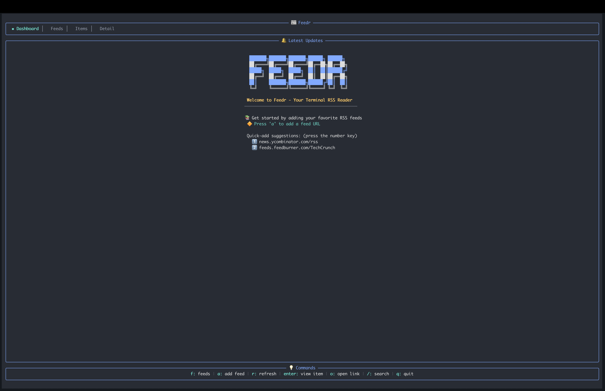

# Feedr - Terminal RSS Feed Reader 📰

Feedr is a feature-rich terminal-based RSS feed reader written in Rust. It provides a clean, intuitive TUI interface for managing and reading RSS feeds with elegant visuals and smooth keyboard navigation.



## Demo


## Features

- **Dashboard View**: See the latest articles across all your feeds, sorted chronologically
- **Feed Management**: Subscribe to and organize multiple RSS/Atom feeds
- **Starred Articles**: Save articles for later with a dedicated starred view
- **Categories**: Organize feeds into custom categories with create, rename, and delete support
- **Advanced Filtering**: Filter articles by category, age, author, read status, starred status, and content length
- **Dual Themes**: Switch between a dark cyberpunk theme and a light zen theme with `t`
- **Live Search**: Instantly search across all feed titles and article content
- **Summary View**: "What's New" screen shows articles added since your last session with per-feed stats
- **Read/Unread Tracking**: Persistent read state tracking across sessions
- **Article Preview**: Toggle an inline preview pane in the feed items view
- **OPML Import**: Bulk import feeds from OPML files via `feedr --import <file.opml>`
- **Browser Integration**: Open articles in your default browser
- **Background Refresh**: Automatic feed updates with configurable intervals and smart rate limiting
- **Rate Limiting**: Per-domain request throttling prevents "too many requests" errors (ideal for Reddit feeds)
- **Vim-Style Navigation**: Use `j`/`k` alongside arrow keys for navigation
- **Rich Content Display**: HTML-to-text conversion with clean article formatting
- **Authenticated Feeds**: Support for custom HTTP headers per feed (e.g., `Authorization: Bearer ...`) for private/authenticated RSS feeds
- **Compact Mode**: Automatic compact layout for small terminals (≤30 rows), with manual `always`/`never` override in config
- **CLI Config Management**: Get, set, and list configuration from the command line (`feedr config`), or use the interactive TUI config editor (`feedr config --tui`)
- **Configurable**: Customize timeouts, themes, UI behavior, and default feeds via TOML config
- **XDG Compliant**: Follows standard directory specifications for configuration and data storage

## Installation

### Prerequisites

- Rust and Cargo (install from [https://rustup.rs/](https://rustup.rs/))

### Using Cargo Install (Recommended)
```bash
cargo install feedr
```

### Arch Linux (AUR)
Feedr is available on the [AUR](https://aur.archlinux.org/packages/feedr). Install it using your preferred AUR helper:
```bash
paru -S feedr
# or
yay -S feedr
```

### Build from Source
```bash
git clone https://github.com/bahdotsh/feedr.git
cd feedr
cargo build --release
```

The binary will be available at `target/release/feedr`.

## Usage

Run the application:

```bash
feedr
```

### OPML Import

Import feeds from an OPML file:
```bash
feedr --import feeds.opml
```

### Configuration Management

View and modify settings from the command line:
```bash
feedr config list                      # List all settings with current values
feedr config get ui.theme              # Get a single value
feedr config set ui.theme light        # Set a value (with validation)
feedr config --tui                     # Open interactive TUI config editor
```

Available config keys use dot-notation (e.g. `general.max_dashboard_items`, `network.http_timeout`, `ui.theme`, `ui.compact_mode`). Run `feedr config list` to see all keys. Feed management (`default_feeds`) is only available through the TUI editor.

### Quick Start
1. When you open Feedr for the first time, press `a` to add a feed
2. Enter a valid RSS feed URL (e.g., `https://news.ycombinator.com/rss`)
3. You can also press `1`, `2`, or `3` to quickly add Hacker News, TechCrunch, or BBC News
4. Use arrow keys (or `j`/`k`) to navigate and `Enter` to view items
5. Press `o` to open the current article in your browser
6. Press `t` to toggle between dark and light themes

### Keyboard Controls

#### General Navigation
| Key | Action |
|-----|--------|
| `Tab` | Cycle forward through views |
| `Shift+Tab` | Cycle backward through views |
| `q` | Go back (quit from Dashboard) |
| `Ctrl+Q` | Quit from any view |
| `r` | Refresh all feeds |
| `t` | Toggle dark/light theme |
| `/` | Search mode |

#### Dashboard View
| Key | Action |
|-----|--------|
| `↑/↓` or `k/j` | Navigate items |
| `Enter` | View selected item |
| `f` | Filter articles |
| `c` / `Ctrl+C` | Category management |
| `a` | Add a new feed |
| `s` | Toggle starred |
| `Space` | Toggle read/unread |
| `p` | Toggle preview pane |
| `o` | Open link in browser |
| `1/2/3` | Quick-add demo feeds (HN, TechCrunch, BBC) |

#### Feed List View
| Key | Action |
|-----|--------|
| `q` / `h` / `Esc` | Go to dashboard |
| `↑/↓` or `k/j` | Navigate feeds |
| `Enter` | View feed items |
| `a` | Add a new feed |
| `d` | Delete selected feed |

#### Feed Items View
| Key | Action |
|-----|--------|
| `q` / `h` / `Esc` / `Backspace` | Back to feeds list |
| `Home` | Go to dashboard |
| `↑/↓` or `k/j` | Navigate items |
| `Enter` | View item details |
| `s` | Toggle starred |
| `Space` | Toggle read/unread |
| `o` | Open item in browser |

#### Item Detail View
| Key | Action |
|-----|--------|
| `q` / `h` / `Esc` / `Backspace` | Back to feed items |
| `↑/↓` or `u/d` | Scroll content |
| `Page Up` / `Page Down` | Scroll content (page) |
| `g` | Jump to top |
| `G` / `End` | Jump to bottom |
| `s` / `Space` | Toggle starred |
| `o` | Open item in browser |

#### Categories View
| Key | Action |
|-----|--------|
| `n` | Create new category |
| `e` | Rename category |
| `d` | Delete category |
| `Space` | Expand/collapse category |
| `h` / `Esc` | Back |

#### Filter Mode (press `f` on Dashboard)
| Key | Action |
|-----|--------|
| `c` | Filter by category |
| `t` | Filter by time/age |
| `a` | Filter by author |
| `r` | Filter by read status |
| `s` | Filter by starred status |
| `l` | Filter by content length |
| `x` | Clear all filters |

## Configuration

Feedr supports customization through a TOML configuration file that follows XDG Base Directory specifications. You can edit the file directly, use `feedr config get/set` from the command line, or use `feedr config --tui` for an interactive editor.

### Configuration File Location

- **Linux/macOS**: `~/.config/feedr/config.toml`
- **Windows**: `%APPDATA%\feedr\config.toml`

The configuration file is automatically generated with default values on first run if it doesn't exist.

### Available Settings

```toml
# Feedr Configuration File

[general]
max_dashboard_items = 100           # Maximum number of items shown on dashboard
auto_refresh_interval = 0           # Auto-refresh interval in seconds (0 = disabled)
refresh_enabled = false             # Enable automatic background refresh
refresh_rate_limit_delay = 2000     # Delay in milliseconds between requests to same domain

[network]
http_timeout = 15              # HTTP request timeout in seconds
user_agent = "Mozilla/5.0 (compatible; Feedr/1.0; +https://github.com/bahdotsh/feedr)"

[ui]
tick_rate = 100                # UI update rate in milliseconds
error_display_timeout = 3000   # Error message duration in milliseconds
theme = "dark"                 # Theme: "dark" (cyberpunk) or "light" (zen)
compact_mode = "auto"          # Compact layout: "auto", "always", or "never"

# Optional: Define default feeds to load on first run
[[default_feeds]]
url = "https://example.com/feed.xml"
category = "News"

# Authenticated feed with custom HTTP headers
[[default_feeds]]
url = "https://private.example.com/feed.xml"
[default_feeds.headers]
Authorization = "Bearer your_token_here"
```

### Configuration Options Explained

#### General Settings
- **max_dashboard_items**: Controls how many items are displayed on the dashboard (default: 100)
- **auto_refresh_interval**: Automatically refresh feeds at specified interval in seconds (0 disables auto-refresh)
- **refresh_enabled**: Master switch to enable/disable automatic background refresh (default: false)
- **refresh_rate_limit_delay**: Delay in milliseconds between requests to the same domain to prevent "too many requests" errors (default: 2000ms). This is especially useful for Reddit feeds and other rate-limited services.

#### Network Settings
- **http_timeout**: Timeout for HTTP requests when fetching feeds (useful for slow connections)
- **user_agent**: Custom User-Agent string for HTTP requests

#### UI Settings
- **tick_rate**: How frequently the UI updates in milliseconds (lower = more responsive, higher = less CPU usage)
- **error_display_timeout**: How long error messages are displayed in milliseconds
- **theme**: Choose between `"dark"` (cyberpunk aesthetic with neon colors) or `"light"` (zen minimalist with organic colors). Can also be toggled at runtime with `t`.
- **compact_mode**: Controls the compact layout for small terminals. `"auto"` (default) enables compact mode when terminal height is ≤30 rows, `"always"` forces compact mode, and `"never"` disables it. Compact mode uses single-line items, a minimal title bar, and an abbreviated help bar to maximize screen real estate.

#### Background Refresh Example
To enable automatic refresh every 5 minutes with rate limiting:
```toml
[general]
refresh_enabled = true
auto_refresh_interval = 300  # 5 minutes
refresh_rate_limit_delay = 2000  # 2 seconds between requests to same domain
```

**Note**: Rate limiting groups feeds by domain and staggers requests to prevent hitting API limits. For example, if you have multiple Reddit feeds, they will be fetched with a 2-second delay between each request to avoid getting blocked.

#### Default Feeds
You can define feeds to be automatically loaded on first run:
```toml
[[default_feeds]]
url = "https://news.ycombinator.com/rss"
category = "Tech"

[[default_feeds]]
url = "https://example.com/feed.xml"
category = "News"
```

#### Authenticated Feeds
Some RSS feeds require authentication or custom HTTP headers. You can configure per-feed headers:
```toml
[[default_feeds]]
url = "https://private.example.com/feed.xml"
[default_feeds.headers]
Authorization = "Bearer your_api_token"

[[default_feeds]]
url = "https://another-api.example.com/rss"
[default_feeds.headers]
X-API-Key = "your_api_key"
Cookie = "session=abc123"
```
Headers are sent with every request for that feed, including refreshes.

### Data Storage

Feedr stores your bookmarks, categories, read/unread state, and starred articles in:
- **Linux/macOS**: `~/.local/share/feedr/feedr_data.json`
- **Windows**: `%LOCALAPPDATA%\feedr\feedr_data.json`

### Backwards Compatibility

Feedr automatically migrates data from older versions to the new XDG-compliant locations. Your existing data will be preserved and automatically moved to the correct location on first run.

## Dependencies

- **[ratatui](https://github.com/ratatui-org/ratatui)**: Terminal UI framework
- **[crossterm](https://github.com/crossterm-rs/crossterm)**: Terminal manipulation
- **[reqwest](https://github.com/seanmonstar/reqwest)**: HTTP client (with gzip/deflate/brotli support)
- **[feed-rs](https://github.com/feed-rs/feed-rs)**: RSS and Atom feed parsing
- **[html2text](https://github.com/servo/html5ever)**: HTML to text conversion
- **[chrono](https://github.com/chronotope/chrono)**: Date and time handling
- **[serde](https://github.com/serde-rs/serde)**: Serialization/deserialization
- **[clap](https://github.com/clap-rs/clap)**: Command-line argument parsing
- **[opml](https://github.com/Holllo/opml)**: OPML import support
- **[toml](https://github.com/toml-rs/toml)**: Configuration file parsing

## License

MIT

## Contributing

Contributions are welcome! Please feel free to submit a Pull Request.

1. Fork the repository
2. Create your feature branch (`git checkout -b feature/amazing-feature`)
3. Commit your changes (`git commit -m 'Add some amazing feature'`)
4. Push to the branch (`git push origin feature/amazing-feature`)
5. Open a Pull Request
